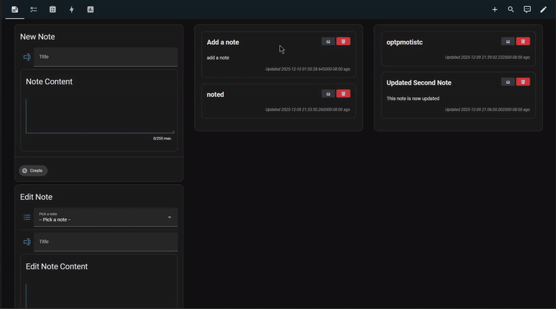
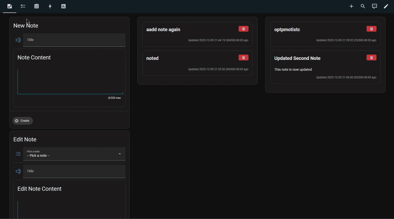
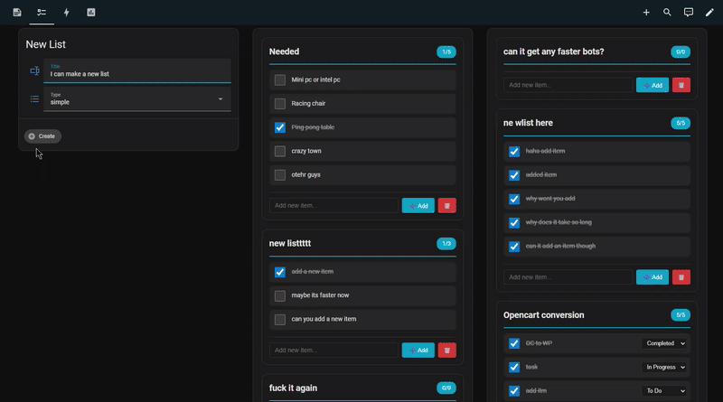

# Jotty Notes & Lists for Home Assistant

Home Assistant/HACS integration for Jotty that enables you to manage notes and checklists directly from your Home Assistant dashboard.

### Version 2.2 (12/11/25) Notifications and Note Delivery
*Thank you discord testers!*
- [2.1 to 2.2 fix here](#21to22) Simply replace 1 script and 1 automation
- **Built in Reminder System**: Set up recurring notifications for incomplete list or task lists
- **Multi device Support**: Send reminders to multiple home assistant devices simultaneously
- **Flexible Scheduling**: Configure intervals, time windows, and day preferences
- **Custom Messages**: Personalize notification titles and messages
- **Send Notes to Devices**: Push notes directly to home assistant devices
- **Task lists have been added!**: Create, edit, and delete task lists from Home Assistant
- Create, edit, delete custom tasks statuses
- Create sub tasks for task items
- All tasks and items are imported as their own individual sensor





### Basically it does this

- **NEW!! 2.2 : Reminder System**: Set up recurring notifications for incomplete items with flexible scheduling.
- **NEW!! 2.1 : Send Notes To Devices**: Send notes directly to multiple devices
- **NEW!! 2.0 : Tasklist Support**: Create and manage task lists!
- **Full Note Management**: Create, edit, and delete notes from Home Assistant
- **Checklist Support**: Create and manage simple checklists
- **Real Time Synchronization**: Changes sync with your Jotty server automatically
- **Granule Notifications**: Every note, list and item is imported as a sensor, giving you control over every detail
- **Demo Dashboard**: Pre built Lovelace dashboard with full functionality included
- **Statistics Tracking**: Monitor note counts, list, task completion rates, and more

### Requirements

- **Home Assistant**: Version 2024.1.0 or newer
- **Jotty**: A running [Jotty](https://github.com/fccview/jottyinstance)
- **API Key**: Valid [Jotty](https://github.com/fccview/jottyinstance) API key with read/write permissions
- **HACS**: Home Assistant Community Store for easy installation and updates
- **File Editor**: Studio Code Server or File Editor addon for configuration
- **Lovelace UI**: Standard Home Assistant frontend

### Before You Begin

You must create a category named "Home Assistant" in your [Jotty](https://github.com/fccview/jottyinstance) application:

1. Open [Jotty](https://github.com/fccview/jottyinstance) on mobile or desktop
2. Go to Notes section
3. Create a new category called "Home Assistant"
4. Go to Lists section
5. Create a new category called "Home Assistant"

This category is REQUIRED for the integration to work. All notes and lists created from Home Assistant will automatically use this category.

## Installation

Complete instructions are available in the [Jotty: Notes and lists for Home Assistant Installation Guide](INSTALLATION.md).

## Notification blueprint
*a ready made notficiation blueprint for this integration is available below*

[](https://my.home-assistant.io/redirect/blueprint_import/?blueprint_url=https://raw.githubusercontent.com/gelatinescreams/HA-HACS-Notes-and-Lists-Jotty-integration/refs/heads/main/blueprints/automation/jotty_notifications_blueprint.yaml)

## Usage

### Creating Notes

**Full interactive dashboard available in [Jotty: Notes and lists for Home Assistant Installation Guide](INSTALLATION.md)**:
1. Go to the Notes tab on your Jotty dashboard
2. Enter a title and content in the "New Note" section
3. Click "Create"
4. The note appears immediately in the "All Notes" section

**Via Service Call**:
```yaml
service: jotty.create_note
data:
  title: "My Note Title"
  content: "Note content goes here"
```

**Via Automation**:
```yaml
action:
  - service: jotty.create_note
    data:
      title: "Reminder: {{ now().strftime('%A') }}"
      content: "Do not forget to check the mail"
```

### Creating Checklists

**Full interactive dashboard available in [Jotty: Notes and lists for Home Assistant Installation Guide](INSTALLATION.md)**:
1. Go to the Lists tab
2. Enter a title
3. Click "Create"
4. The list appears in your lists view

**Via Service Call**:
```yaml
service: jotty.create_checklist
data:
  title: "Shopping List"
  type: "simple"
```

### Creating Task Lists (Kanban)

Task lists provide Kanban style organization with customizable status columns.

**Via Dashboard**:
1. Go to the Tasks tab
2. Enter a title
3. Click "Create"
4. Use the Columns button to customize Kanban columns

**Via Service Call**:
```yaml
service: jotty.create_task
data:
  title: "Sprint Tasks"
```

### Managing Items

**Add Item to List**:
```yaml
service: jotty.add_checklist_item
data:
  checklist_id: "YOUR_CHECKLIST_ID"
  text: "Buy milk"
  status: "todo"
```

**Add Nested Sub Item** (supports unlimited nesting):
```yaml
service: jotty.add_checklist_item
data:
  checklist_id: "YOUR_CHECKLIST_ID"
  text: "Sub task under first item"
  parent_index: "0"
```

```yaml
# Deeper nesting example
service: jotty.add_checklist_item
data:
  checklist_id: "YOUR_CHECKLIST_ID"
  text: "Sub sub task"
  parent_index: "0.1"
```

**Check Item**:
```yaml
service: jotty.check_item
data:
  checklist_id: "YOUR_CHECKLIST_ID"
  item_index: "0"
```

**Check Nested Item**:
```yaml
service: jotty.check_item
data:
  checklist_id: "YOUR_CHECKLIST_ID"
  item_index: "0.0"
```

**Uncheck Item**:
```yaml
service: jotty.uncheck_item
data:
  checklist_id: "YOUR_CHECKLIST_ID"
  item_index: "0"
```

**Delete Item** (including nested):
```yaml
service: jotty.delete_checklist_item
data:
  checklist_id: "YOUR_CHECKLIST_ID"
  item_index: "0.1"
```

### Managing Task Items

**Add Task Item**:
```yaml
service: jotty.add_task_item
data:
  task_id: "YOUR_TASK_ID"
  text: "Implement feature"
  status: "todo"
```

**Add Sub Task**:
```yaml
service: jotty.add_task_item
data:
  task_id: "YOUR_TASK_ID"
  text: "Write unit tests"
  status: "todo"
  parent_index: "0"
```

**Update Task Item Status** (move between Kanban columns):
```yaml
service: jotty.update_task_item_status
data:
  task_id: "YOUR_TASK_ID"
  item_index: "0"
  status: "in_progress"
```

> **Known Issue**: The Jotty API has a bug where `update_task_item_status` returns success but doesn't persist the change. This affects both top level and nested items. Items can be created with an initial status, but cannot be moved between columns. The Jotty developer is aware of this and a fix is coming ASAP

**Delete Task Item**:
```yaml
service: jotty.delete_task_item
data:
  task_id: "YOUR_TASK_ID"
  item_index: "0.0"
```

### Managing Kanban Columns (Task Statuses)

**Get All Statuses**:
```yaml
service: jotty.get_task_statuses
data:
  task_id: "YOUR_TASK_ID"
```

**Create Custom Status Column**:
```yaml
service: jotty.create_task_status
data:
  task_id: "YOUR_TASK_ID"
  status_id: "review"
  label: "In Review"
  color: "#3b82f6"
  order: 2
```

**Update Status Column**:
```yaml
service: jotty.update_task_status
data:
  task_id: "YOUR_TASK_ID"
  status_id: "review"
  label: "Code Review"
  color: "#8b5cf6"
```

**Delete Status Column**:
```yaml
service: jotty.delete_task_status
data:
  task_id: "YOUR_TASK_ID"
  status_id: "review"
```

### Editing and Deleting

**Update Note**:
```yaml
service: jotty.update_note
data:
  note_id: "YOUR_NOTE_ID"
  title: "Updated Title"
  content: "Updated content"
```

**Delete Note**:
```yaml
service: jotty.delete_note
data:
  note_id: "YOUR_NOTE_ID"
```

**Delete Checklist**:
```yaml
service: jotty.delete_checklist
data:
  checklist_id: "YOUR_CHECKLIST_ID"
```

**Delete Task List**:
```yaml
service: jotty.delete_task
data:
  task_id: "YOUR_TASK_ID"
```

### Reminder System

The built-in reminder system allows you to set up recurring notifications for incomplete list and task items.

**Set Up a Reminder via Script**:
```yaml
service: script.jotty_save_reminder_inline
data:
  item_id: "YOUR_LIST_OR_TASK_ID"
  item_type: "checklist"  # or "task"
  target: "notify.mobile_app_your_phone"
  interval: "1 hour"
  days: "weekdays"
  start_time: "09:00"
  end_time: "18:00"
  custom_title: "Shopping Reminder"  # optional
  custom_message: "Don't forget your shopping list!"  # optional
```

**Remove a Reminder**:
```yaml
service: script.jotty_remove_reminder_inline
data:
  item_id: "YOUR_LIST_OR_TASK_ID"
```

**Send Note to Mobile Devices**:
```yaml
service: script.jotty_send_note_to_devices
data:
  targets: "notify.mobile_app_phone1,notify.mobile_app_phone2"
  title: "Important Note"
  message: "This is the note content"
```

**Reminder Options**:

| Option | Values |
|--------|--------|
| Interval | 30 minutes, 1 hour, 2 hours, 4 hours, 8 hours, 12 hours, Once a day |
| Days | Weekdays, Weekends, Every day |
| Time Window | Any start/end time (e.g., 09:00 - 18:00) |

## Service Reference

### Note Services

| Service | Description |
|---------|-------------|
| `jotty.create_note` | Create a new note |
| `jotty.update_note` | Update existing note |
| `jotty.delete_note` | Delete a note |

#### jotty.create_note

| Field | Type | Required | Description |
|-------|------|----------|-------------|
| title | string | Yes | The title of the note |
| content | string | No | The content of the note |

#### jotty.update_note

| Field | Type | Required | Description |
|-------|------|----------|-------------|
| note_id | string | Yes | The UUID of the note to update |
| title | string | No | New title for the note |
| content | string | No | New content for the note |

#### jotty.delete_note

| Field | Type | Required | Description |
|-------|------|----------|-------------|
| note_id | string | Yes | The UUID of the note to delete |

### Checklist Services

| Service | Description |
|---------|-------------|
| `jotty.create_checklist` | Create a new checklist |
| `jotty.delete_checklist` | Delete a checklist |
| `jotty.add_checklist_item` | Add item to checklist |
| `jotty.check_item` | Mark item as completed |
| `jotty.uncheck_item` | Mark item as incomplete |
| `jotty.delete_checklist_item` | Delete item from checklist |

#### jotty.create_checklist

| Field | Type | Required | Description |
|-------|------|----------|-------------|
| title | string | Yes | The title of the checklist |
| type | string | No | "simple" or "task" (default: "simple") |

#### jotty.add_checklist_item

| Field | Type | Required | Description |
|-------|------|----------|-------------|
| checklist_id | string | Yes | The UUID of the checklist |
| text | string | Yes | The text of the item |
| status | string | No | Initial status (for task type) |
| parent_index | string | No | Parent item index for nesting (e.g., "0" or "0.1") |

#### jotty.check_item / jotty.uncheck_item

| Field | Type | Required | Description |
|-------|------|----------|-------------|
| checklist_id | string | Yes | The UUID of the checklist |
| item_index | string | Yes | Index path of the item (e.g., "0" or "0.1") |

#### jotty.delete_checklist_item

| Field | Type | Required | Description |
|-------|------|----------|-------------|
| checklist_id | string | Yes | The UUID of the checklist |
| item_index | string | Yes | Index path of the item to delete |

### Task Services

| Service | Description |
|---------|-------------|
| `jotty.create_task` | Create a new task list |
| `jotty.delete_task` | Delete a task list |
| `jotty.add_task_item` | Add item to task list |
| `jotty.update_task_item_status` | Change item status |
| `jotty.delete_task_item` | Delete task item |
| `jotty.get_task_statuses` | Get Kanban columns |
| `jotty.create_task_status` | Create Kanban column |
| `jotty.update_task_status` | Update Kanban column |
| `jotty.delete_task_status` | Delete Kanban column |

#### jotty.create_task

| Field | Type | Required | Description |
|-------|------|----------|-------------|
| title | string | Yes | The title of the task list |

#### jotty.add_task_item

| Field | Type | Required | Description |
|-------|------|----------|-------------|
| task_id | string | Yes | The UUID of the task list |
| text | string | Yes | The text of the task item |
| status | string | No | Initial status (default: "todo") |
| parent_index | string | No | Parent item index for sub tasks |

#### jotty.update_task_item_status

| Field | Type | Required | Description |
|-------|------|----------|-------------|
| task_id | string | Yes | The UUID of the task list |
| item_index | string | Yes | Index path of the item |
| status | string | Yes | New status value |

#### jotty.delete_task_item

| Field | Type | Required | Description |
|-------|------|----------|-------------|
| task_id | string | Yes | The UUID of the task list |
| item_index | string | Yes | Index path of the item to delete |

#### jotty.create_task_status

| Field | Type | Required | Description |
|-------|------|----------|-------------|
| task_id | string | Yes | The UUID of the task list |
| status_id | string | Yes | Unique identifier for the status |
| label | string | Yes | Display name for the column |
| color | string | No | Hex color code (e.g., "#3b82f6") |
| order | integer | No | Display order (lower = left) |

#### jotty.update_task_status

| Field | Type | Required | Description |
|-------|------|----------|-------------|
| task_id | string | Yes | The UUID of the task list |
| status_id | string | Yes | The ID of the status to update |
| label | string | No | New display name |
| color | string | No | New hex color code |
| order | integer | No | New display order |

#### jotty.delete_task_status

Delete a Kanban column (items move to first available status).

| Field | Type | Required | Description |
|-------|------|----------|-------------|
| task_id | string | Yes | The UUID of the task list |
| status_id | string | Yes | The ID of the status to delete |

## Sensors

The integration creates multiple sensors for monitoring your Jotty data:

### Statistics Sensors

| Sensor | Description |
|--------|-------------|
| `sensor.jotty_total_notes` | Total number of notes in the "Home Assistant" category |
| `sensor.jotty_total_checklists` | Total number of checklists |
| `sensor.jotty_total_tasks` | Total number of task lists |
| `sensor.jotty_total_items` | Total items across all checklists |
| `sensor.jotty_completed_items` | Number of completed items |
| `sensor.jotty_pending_items` | Number of pending (incomplete) items |
| `sensor.jotty_completion_rate` | Overall completion rate percentage |

### Template Sensors (for Reminder System)

| Sensor | Description |
|--------|-------------|
| `sensor.jotty_reminders` | Stores reminder configurations for all lists/tasks |
| `sensor.jotty_available_notifiers` | Lists available mobile app notification services |

### Dynamic Sensors

The integration creates individual sensors for each note, checklist, and task:

#### Note Sensors

`sensor.jotty_note_[title]` One sensor per note

**Attributes**:
- `note_id`: UUID of the note
- `content`: Note content
- `category`: Category (always "Home Assistant")
- `created`: Creation timestamp
- `updated`: Last update timestamp

#### Checklist Sensors

`sensor.jotty_list_[title]`  One sensor per checklist

**Attributes**:
- `checklist_id`: UUID of the checklist
- `title`: Checklist title
- `type`: "simple" or "task"
- `items`: Array of items (with nested children)
- `flat_items`: Flattened array with `index_path` for each item
- `completed`: Count of completed items
- `total`: Total item count
- `completion_rate`: Percentage complete
- `created`: Creation timestamp
- `updated`: Last update timestamp

#### Task Sensors

`sensor.jotty_task_[title]` One sensor per task list

**Attributes**:
- `task_id`: UUID of the task list
- `title`: Task list title
- `items`: Array of items (with nested children)
- `flat_items`: Flattened array with `index_path` for each item
- `statuses`: Array of Kanban column definitions
  - `id`: Status identifier
  - `name`: Display name
  - `color`: Hex color
  - `order`: Sort order
- `status_counts`: Object with count per status
- `todo`: Count of items in "todo" status
- `in_progress`: Count of items in "in_progress" status
- `completed`: Count of items in "completed" status
- `total`: Total item count
- `completion_rate`: Percentage complete
- `created`: Creation timestamp
- `updated`: Last update timestamp

### Nested Items Structure

Items can contain nested children. The `flat_items` attribute provides a flattened view with `index_path` for easy iteration:

```yaml
flat_items:
  - id: "task-123"
    text: "Parent task"
    status: "in_progress"
    index_path: "0"
  - id: "task-456"
    text: "Sub-task"
    status: "todo"
    index_path: "0.0"
  - id: "task-789"
    text: "Another sub task"
    status: "completed"
    index_path: "0.1"
```

## Automation Examples

### Create Shopping List Every Sunday

```yaml
automation:
  - alias: "Create Weekly Shopping List"
    trigger:
      - platform: time
        at: "09:00:00"
    condition:
      - condition: time
        weekday:
          - sun
    action:
      - service: jotty.create_checklist
        data:
          title: "Shopping List {{ now().strftime('%B %d') }}"
          type: "simple"
```

### Reminder Note When Leaving Home

```yaml
automation:
  - alias: "Create Reminder When Leaving"
    trigger:
      - platform: state
        entity_id: person.your_name
        from: "home"
        to: "not_home"
    action:
      - service: jotty.create_note
        data:
          title: "Left Home Reminder"
          content: "You left home at {{ now().strftime('%I:%M %p') }}. Did you remember to lock the door?"
```

### Notify When Tasks Are Completed

```yaml
automation:
  - alias: "Notify on Task Completion"
    trigger:
      - platform: state
        entity_id: sensor.jotty_completion_rate
    condition:
      - condition: numeric_state
        entity_id: sensor.jotty_completion_rate
        above: 95
    action:
      - service: notify.mobile_app
        data:
          message: "Great job! You have completed {{ states('sensor.jotty_completed_items') }} tasks today!"
```

### Auto Create Daily Task List

```yaml
automation:
  - alias: "Create Daily Tasks"
    trigger:
      - platform: time
        at: "06:00:00"
    action:
      - service: jotty.create_task
        data:
          title: "Tasks for {{ now().strftime('%A, %B %d') }}"
```

### Create Sprint Task List with Custom Columns

```yaml
automation:
  - alias: "Create Sprint Board"
    trigger:
      - platform: time
        at: "09:00:00"
    condition:
      - condition: time
        weekday:
          - mon
    action:
      - service: jotty.create_task
        data:
          title: "Sprint {{ now().isocalendar()[1] }}"
      # Add custom columns after creation via dashboard or additional service calls
```

### Auto-Setup Reminder for New Lists

```yaml
automation:
  - alias: "Auto Setup Shopping List Reminder"
    trigger:
      - platform: state
        entity_id: sensor.jotty_total_checklists
    condition:
      - condition: template
        value_template: "{{ 'Shopping' in trigger.to_state.attributes.get('titles', []) }}"
    action:
      - service: script.jotty_save_reminder_inline
        data:
          item_id: "{{ trigger.to_state.attributes.latest_id }}"
          item_type: "checklist"
          target: "notify.mobile_app_your_phone"
          interval: "2 hours"
          days: "every_day"
          start_time: "09:00"
          end_time: "20:00"
```

## Dashboard Overview

The included dashboard provides a complete interface for managing your notes, lists, and tasks:

### Notes Tab

- Create new notes with title and content
- Edit existing notes using dropdown picker
- Delete notes with confirmation
- View all notes with timestamps
- See formatted content
- Send notes to mobile devices

### Lists Tab

- Create new checklists (simple type)
- Add items directly from the card
- Toggle item completion with checkboxes
- Delete individual items
- Delete entire lists with confirmation
- View progress (completed/total)
- Set up reminders for incomplete items

### Tasks Tab

- Create new task lists (Kanban style)
- Add tasks with initial status selection
- Add sub tasks with the ➕ button on each item
- View nested items with visual indentation
- Status dropdown to move between columns (pending API fix)
- Customize task list categories via Columns button:
  - View existing columns with colors
  - Rename columns
  - Delete columns
  - Add new custom columns with ID, label, and color
- Delete individual tasks
- Delete entire task lists with confirmation
- Set up reminders for incomplete tasks

### Quick Actions Tab

- One tap creation of common note types
- Quick list templates
- Shopping list creator
- Daily task list creator
- Meal plan template
- Packing list template
- Force refresh button
- Update dropdowns button

### Statistics Tab

- Visual statistics cards
- Total notes count
- Total lists count
- Total tasks count
- Completion rate percentage
- Items completed counter
- Pending items counter
- Detailed statistics table

## Known Issues

### Task Item Status Not Persisting

**Issue**: The `jotty.update_task_item_status` service returns success but the status change is not saved.

**Affected Endpoints**:
- `PUT /api/tasks/{id}/items/{index}/status` Top level items
- `PUT /api/tasks/{id}/items/{index.subindex}/status` Nested items

**Status**: Reported to Jotty developer. All other API endpoints work correctly.

## Index Path Reference

For nested items, use dot notation to specify the path:

| Path | Description |
|------|-------------|
| `"0"` | First top level item |
| `"1"` | Second top level item |
| `"0.0"` | First child of first item |
| `"0.1"` | Second child of first item |
| `"2.0.1"` | Second child of first child of third item |

This applies to all services that accept `item_index` or `parent_index` parameters.

### Getting Help & Troubleshooting

- [Notes and lists for Home Assistant Installation Guide](INSTALLATION.md)
- [Troubleshooting Guide](TROUBLESHOOTING.md)

## Acknowledgments

- [Home Assistant Community](https://www.home-assistant.io)  for excellent documentation and support
- [Jotty](https://jotty.page) developer for creating an amazing notes and lists application with API
- [HACS](https://www.hacs.xyz) for making custom integrations accessible to everyone

## Roadmap

- API update for advanced task lists from Jotty. All task list code is already done in anticipation of this api addition.
- Clean old notes and list from sensors (May not be possbile automatically)
- Advanced filtering and search
- Calendar integration for task deadlines

## 2.1to2.2

- Update the entire jotty_update_last_sent block in your scripts.yaml with the new one from 2.2
- Update the entire jotty_check_reminders block in your automations.yaml with the new one from 2.2